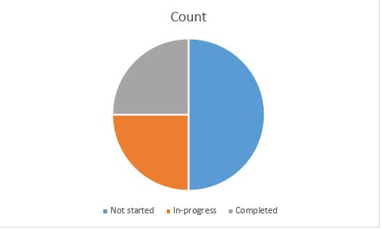

# Microsoft Graph Excel REST API ASP.NET to-do list sample

This sample shows how to read and write into an Excel document stored in your OneDrive for Business account by using the Excel REST APIs.

## Prerequisites

To use the Microsoft Graph Excel REST API ASP.NET to-do list sample, you need the following:
* Visual Studio 2015 installed and working on your development computer. 

     > Note: This sample is written using Visual Studio 2015. If you're using Visual Studio 2013, make sure to change the compiler language version to 5 in the Web.config file:  **compilerOptions="/langversion:5**
* A Microsoft Office 365 account. You can sign up for [an Office 365 Developer subscription](https://portal.office.com/Signup/Signup.aspx?OfferId=6881A1CB-F4EB-4db3-9F18-388898DAF510&DL=DEVELOPERPACK&ali=1#0) that includes the resources that you need to start building apps.

     > Note: If you already have a subscription, the previous link sends you to a page with the message *Sorry, you can’t add that to your current account*. In that case, use an account from your current Office 365 subscription.
* A Microsoft Azure Tenant to register your application. Azure Active Directory (AD) provides identity services that applications use for authentication and authorization. A trial subscription can be acquired here: [Microsoft Azure](https://account.windowsazure.com/SignUp).

     > Important: You also need to make sure your Azure subscription is bound to your Office 365 tenant. To do this, see the Active Directory team's blog post, [Creating and Managing Multiple Windows Azure Active Directories](http://blogs.technet.com/b/ad/archive/2013/11/08/creating-and-managing-multiple-windows-azure-active-directories.aspx). The section **Adding a new directory** will explain how to do this. You can also see [Set up your Office 365 development environment](https://msdn.microsoft.com/office/office365/howto/setup-development-environment#bk_CreateAzureSubscription) and the section **Associate your Office 365 account with Azure AD to create and manage apps** for more information.
* The client ID and redirect URI values of an application registered in Azure. This sample application must be granted the **Have full access to user files and files shared with user** permission for **Microsoft Graph**. [Add a web application in Azure](https://msdn.microsoft.com/office/office365/HowTo/add-common-consent-manually#bk_RegisterWebApp) and grant the proper permissions to it:
	* In the [Azure Management Portal](https://manage.windowsazure.com/), select the **Active Directory** tab and an Office 365 tenant.
	* Select the **Applications** tab and choose the application that you want to configure.
	* In the **permissions to other applications** section, add the **Microsoft Graph** application.
	* For the **Microsoft Graph** application, add the following delegated permissions: **Have full access to user files and files shared with user**.
	* Save the changes.

     > Note: During the app registration process, make sure to specify **http://localhost:21942** as the **Sign-on URL**.  

## Configure the app
1. Open **Microsoft-Graph-ExcelRest-ToDo.sln** file. 
2. In Solution Explorer, open the **Web.config** file. 
3. Replace *ENTER_YOUR_CLIENT_ID* with the client ID of your registered Azure application.
4. Replace *ENTER_YOUR_SECRET* with the key of your registered Azure application.

## Run the app

1. Press F5 to build and debug. Run the solution and sign in with your organizational account. The application launches on your local host and shows the starter page. 

     > Note: Copy and paste the start page URL address **http://localhost:21942/home/index** to a different browser if you get the following error during sign in: **AADSTS70001: Application with identifier ad533dcf-ccad-469a-abed-acd1c8cc0d7d was not found in the directory**.
2. Choose the `Click here to sign in` button in the middle of the page or the `Sign in` link at the top right of the page and authenticate with your Office 365 account. 
3. Select the `ToDoList` link from the top menu bar.
4. The application checks to see if a file named `ToDoList.xlsx` exists in the root OneDrive folder of your O365 account. If it doesn't find this file, it uploads a blank `ToDoList.xlsx` workbook and adds all of the necessary tables, columns, and rows, along with a chart. After finding or uploading and configuring the workbook, the application then displays the task list page. If the workbook contains no tasks, you'll see an empty list.
5. If you're running the application for the first time, you can verify that the application uploaded and configured the `ToDoList.xlsx` file by navigating to **https://yourtenant.sharepoint.com**, clicking on the App Launcher "Waffle" at the top left of the page, and then choosing the OneDrive application. You'll see a file named **ToDoList.xlsx** in the root directory, and when you click on the file, you'll see worksheets named **ToDoList** and **Summary**. The **ToDoList** worksheet contains a table that lists each "to-do" item, and the **Summary** worksheet contains a summary table and a chart.
6. Select the `Add New' link to add a new task. Fill in the form with the task details.
7. After you add a task, the app shows the updated task listing. If the newly added task isn't updated, choose the `Refresh` link after a few moments.

8. Choose the `Charts' link to see the breakdown of tasks in a pie chart that was created and downloaded by using the Excel REST API.

## Questions and comments

We'd love to get your feedback about the Microsoft Graph Excel REST API ASP.NET MVC sample. You can send your questions and suggestions to us in the [Issues](https://github.com/OfficeDev/Microsoft-Graph-ASPNET-ExcelREST-ToDo/issues) section of this repository.

Questions about Office 365 development in general should be posted to [Stack Overflow](http://stackoverflow.com/questions/tagged/MicrosoftGraph). Make sure that your questions or comments are tagged with [MicrosoftGraph].
  
## Additional resources

* [Microsoft Graph documentation](http://graph.microsoft.io)

## Copyright
Copyright (c) 2016 Microsoft. All rights reserved.
