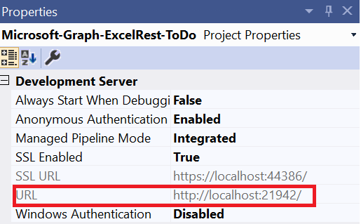
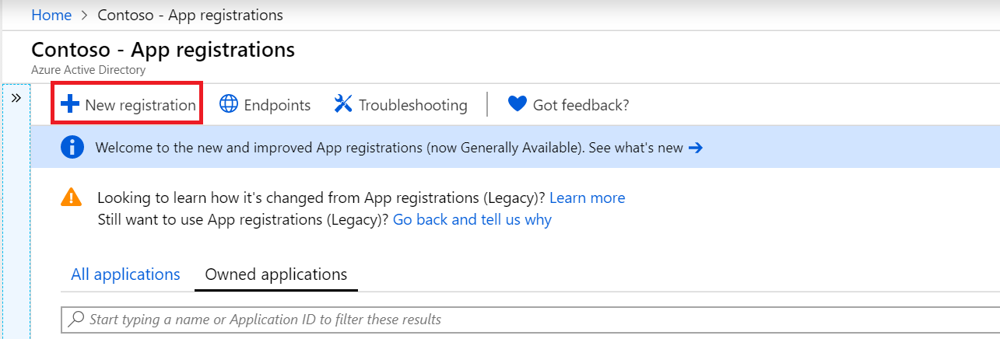
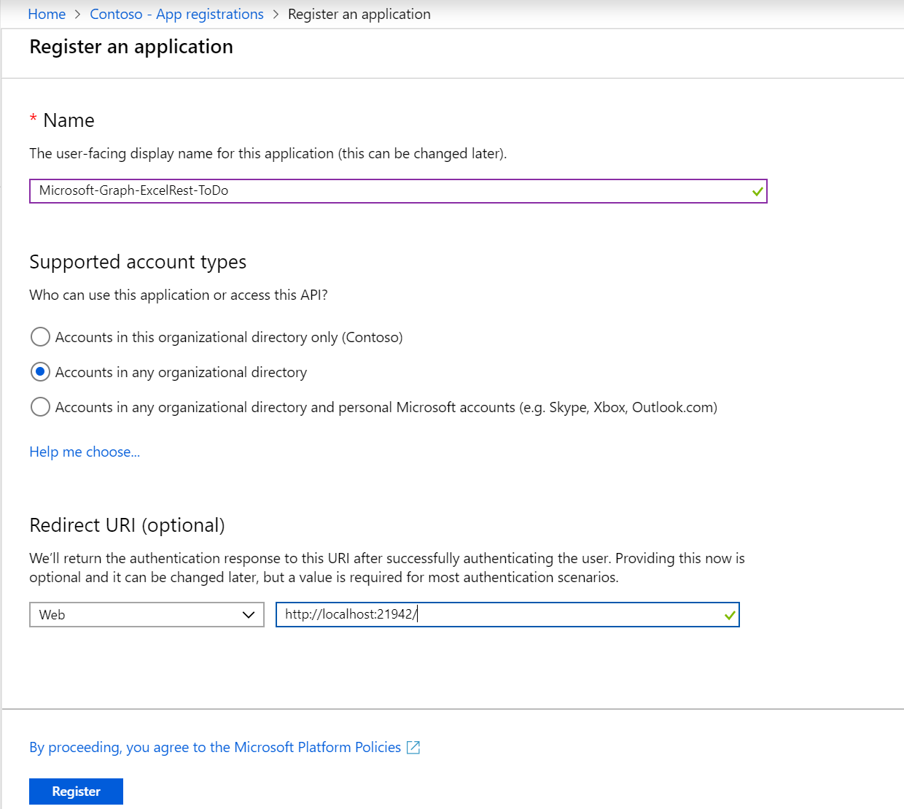
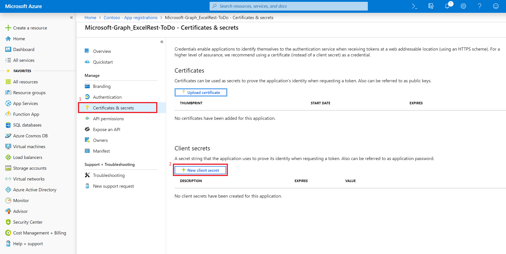
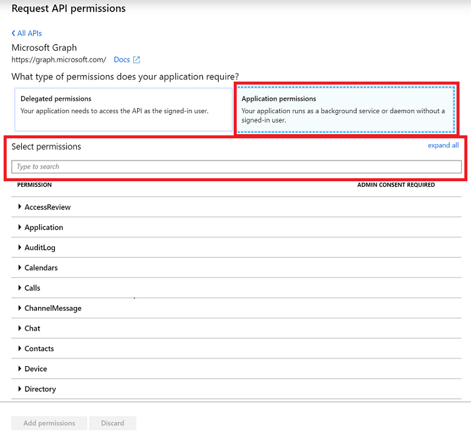
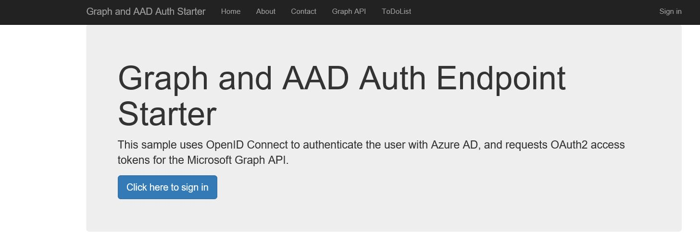

# Microsoft Graph Excel REST API ASP.NET to-do list sample

This sample shows how to read and write into an Excel document stored in your OneDrive for Business account by using the Excel REST APIs.

## Prerequisites

This sample requires the following:  

  * [Visual Studio 2015](https://www.visualstudio.com/en-us/downloads) 
  * Either a [Microsoft account](https://www.outlook.com) or [work or school account](https://dev.office.com/devprogram)

## Register the application 
 
1. Determine your ASP.NET app's URL. In Visual Studio's Solution Explorer, select the Microsoft-Graph-ExcelRest-ToDo project. In the Properties window, find the value of SSL URL. Copy this value.  
 

2. Navigate to the [the Azure portal - App registrations](https://go.microsoft.com/fwlink/?linkid=2083908) to register your app. Login using a **Work or School Account**.  

 
3. Select **New registration**. On the **Register an application** page, set the values as follows. 
 
* Set **Name** to Microsoft-Graph-ExcelRest-ToDo. 
* Set **Supported account types** to **Accounts in any organizational directory**. 
* Leave **Redirect URI** empty. 
* Choose **Register**.  

 
4. On the **Microsoft-Graph-ExcelRest-ToDo** page, copy and save the values for the **Application (client) ID**.  
 
 
5. Select **Certificates & secrets** under **Manage**. Select the **New client secret** button. Enter a value in **Description**, select any option for **Expires** and choose **Add**.  

 
6. Copy the client secret value before leaving the page. You will need it in the next step.  
 
 
7. Select **API permissions** and then select **Add a permission**. On the panel that appears, choose **Microsoft Graph** and then choose **Application permissions**.  

 
8. Use the **Select permissions** search box to search for the following permissions: [PERMISSIONS TO REQUEST]. Select the check box for each permission as it appears (note that the permissions will not remain visible in the list as you select each one). Select the **Add permissions** button at the bottom of the panel. 
 
9. Choose the **Grant admin consent for [tenant name]** button. Select **Yes** for the confirmation that appears.  
 

## Configure the app
1. Open **Microsoft-Graph-ExcelRest-ToDo.sln** file. 
2. In Solution Explorer, open the **Web.config** file. 
3. Replace *ENTER_YOUR_CLIENT_ID* with the client ID of your registered Azure application.
4. Replace *ENTER_YOUR_SECRET* with the key of your registered Azure application.

## Run the app

1. Press F5 to build and debug. Run the solution and sign in with your organizational account. The application launches on your local host and shows the starter page. 

     > Note: Copy and paste the start page URL address **http://localhost:21942/home/index** to a different browser if you get the following error during sign in: **AADSTS70001: Application with identifier ad533dcf-ccad-469a-abed-acd1c8cc0d7d was not found in the directory**.
2. Choose the `Click here to sign in` button in the middle of the page or the `Sign in` link at the top right of the page and authenticate with your Office 365 account. 
3. Select the `ToDoList` link from the top menu bar.
4. The application checks to see if a file named `ToDoList.xlsx` exists in the root OneDrive folder of your O365 account. If it doesn't find this file, it uploads a blank `ToDoList.xlsx` workbook and adds all of the necessary tables, columns, and rows, along with a chart. After finding or uploading and configuring the workbook, the application then displays the task list page. If the workbook contains no tasks, you'll see an empty list.
5. If you're running the application for the first time, you can verify that the application uploaded and configured the `ToDoList.xlsx` file by navigating to **https://yourtenant.sharepoint.com**, clicking on the App Launcher "Waffle" at the top left of the page, and then choosing the OneDrive application. You'll see a file named **ToDoList.xlsx** in the root directory, and when you click on the file, you'll see worksheets named **ToDoList** and **Summary**. The **ToDoList** worksheet contains a table that lists each "to-do" item, and the **Summary** worksheet contains a summary table and a chart.
6. Select the `Add New' link to add a new task. Fill in the form with the task details.
7. After you add a task, the app shows the updated task listing. If the newly added task isn't updated, choose the `Refresh` link after a few moments.

8. Choose the `Charts' link to see the breakdown of tasks in a pie chart that was created and downloaded by using the Excel REST API.

## Contributing ##

If you'd like to contribute to this sample, see [CONTRIBUTING.MD](/CONTRIBUTING.md).

This project has adopted the [Microsoft Open Source Code of Conduct](https://opensource.microsoft.com/codeofconduct/). For more information see the [Code of Conduct FAQ](https://opensource.microsoft.com/codeofconduct/faq/) or contact [opencode@microsoft.com](mailto:opencode@microsoft.com) with any additional questions or comments.

## Questions and comments

We'd love to get your feedback about the Microsoft Graph Excel REST API ASP.NET MVC sample. You can send your questions and suggestions to us in the [Issues](https://github.com/OfficeDev/Microsoft-Graph-ASPNET-ExcelREST-ToDo/issues) section of this repository.

Questions about Office 365 development in general should be posted to [Stack Overflow](http://stackoverflow.com/questions/tagged/MicrosoftGraph). Make sure that your questions or comments are tagged with [MicrosoftGraph].
  
## Additional resources

* [Microsoft Graph documentation](http://graph.microsoft.io)

## Copyright
Copyright (c) 2019 Microsoft. All rights reserved.
